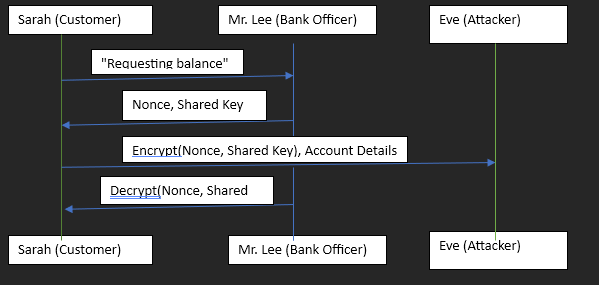

# DY-model

# Diagram:

Scenario:
Customer's Initial Message: Sarah sends a message to Mr. Lee requesting her account balance.

Bank Officer's Challenge: Mr. Lee sends a nonce (a random number used once) and a shared secret key to Sarah.

Customer's Response: Sarah encrypts the nonce with the shared secret key and sends it back to Mr. Lee along with her account details.

Bank Officer's Verification: Mr. Lee decrypts the message with the shared secret key and verifies the nonce.

# Questions:

# 1. What assets are being protected?
Identity Verification: Ensuring that the request for the balance inquiry is indeed from Sarah.

Confidentiality: Protecting the nonce and Sarah's account details from being intercepted or tampered with.

Integrity: Ensuring the message has not been altered during transmission.

# 2. What are the trust assumptions?
Shared Key: Both Sarah and Mr. Lee trust that the shared secret key is known only to them and has not been compromised.

Secure Key Exchange: The initial exchange of the shared key was done over a secure channel.

Honest Participants: Sarah and Mr. Lee are assumed to be honest and follow the protocol correctly.

# 3. What attacks are possible?
Replay Attack: Eve could intercept the encrypted nonce and replay it to Mr. Lee, pretending to be Sarah.

Man-in-the-Middle Attack: Eve could intercept and modify messages between Sarah and Mr. Lee.

Impersonation Attack: Eve could pretend to be Mr. Lee and send a fake nonce or key to Sarah.

# 4. How to secure this protocol?
Use of Nonces: Ensure that nonces are unique and used only once to prevent replay attacks.

Mutual Authentication: Both parties should authenticate each other to prevent impersonation.

Encryption: Use strong encryption algorithms to protect the confidentiality and integrity of messages.

Digital Signatures: Implement digital signatures to verify the authenticity of the messages.

Secure Channels: Use secure communication channels to prevent man-in-the-middle attacks.